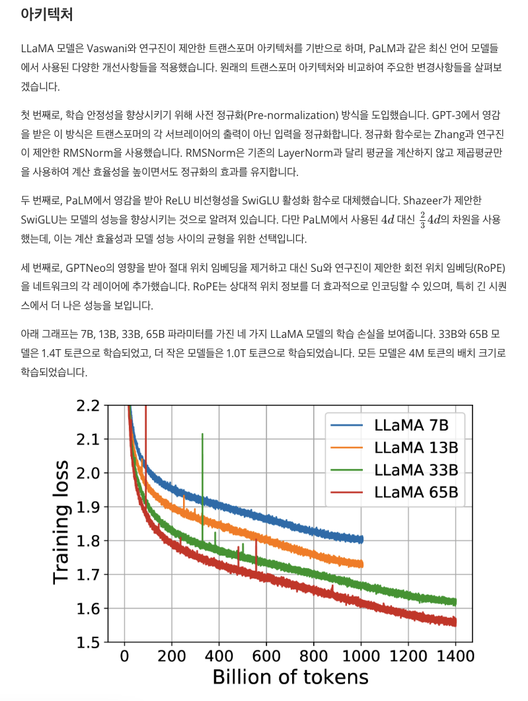

## 👩‍🏫 SCHOLAR-LENS

AI-powered academic paper review assistant that generates comprehensive analyses of arXiv papers through intelligent content extraction, citation analysis, and code repository integration.



### ✨ Features

- **AI-Powered Analysis**: Uses Amazon Bedrock (Claude models) for multi-stage paper understanding
- **Multi-Source Processing**: Extracts content from arXiv HTML/PDF, analyzes citations, and reviews code repositories
- **Scalable Infrastructure**: AWS Batch for containerized job execution
- **Intelligent Extraction**: Figure analysis, table of contents generation, and citation mapping
- **Code Integration**: GitHub repository analysis with semantic search via FAISS

### 🏗️ Architecture

#### Core Components
- **ArxivHandler** (`arxiv_handler.py`): Paper metadata and content retrieval
- **Parser** (`parser.py`): HTML/PDF parsing with figure extraction
- **ContentExtractor** (`content_extractor.py`): Structured content and citation extraction
- **CodeRetriever** (`code_retriever.py`): Repository cloning and semantic code analysis
- **CitationSummarizer** (`citation_summarizer.py`): Reference paper analysis
- **ExplainerGraph** (`explainer.py`): Multi-stage LangGraph workflow for paper synthesis

#### Infrastructure
- **AWS Batch**: Containerized job execution with ECS
- **Amazon Bedrock**: Claude models for analysis and generation
- **S3**: Paper storage and asset management
- **SSM Parameter Store**: Configuration management

### 🛠️ Tech Stack

- Python 3.12+, AWS CDK, Docker
- Amazon Bedrock, LangChain, LangGraph
- PyMuPDF, BeautifulSoup4, FAISS
- Pydantic validation, YAML configuration

### 📋 Configuration

Create `scholar_lens/configs/config.yaml`:

```yaml
resources:
  project_name: scholar-lens
  stage: dev
  profile_name: your-profile
  default_region_name: ap-northeast-2
  bedrock_region_name: us-west-2
  s3_bucket_name: your-bucket
  email_address: your-email@example.com

paper:
  citation_extraction_model_id: anthropic.claude-sonnet-4-5-20250929-v1:0
  table_of_contents_model_id: anthropic.claude-sonnet-4-5-20250929-v1:0

explanation:
  paper_analysis_model_id: anthropic.claude-sonnet-4-5-20250929-v1:0
  paper_synthesis_model_id: anthropic.claude-sonnet-4-5-20250929-v1:0
```

### 🚀 Usage

#### Infrastructure Deployment
```bash
# Deploy infrastructure
python scripts/deploy_infra.py
```

#### Development
```bash
# Install dependencies
poetry install

# Set up environment
cp .env.template .env
# Edit .env with your configuration

# Run locally
python scholar_lens/main.py --arxiv-id 2312.11805 --parse-pdf True

# Submit batch job
python scripts/run_batch.py --arxiv-id 2505.09388 --repo-urls http://arxiv.org/pdf/2505.09388v1
```
