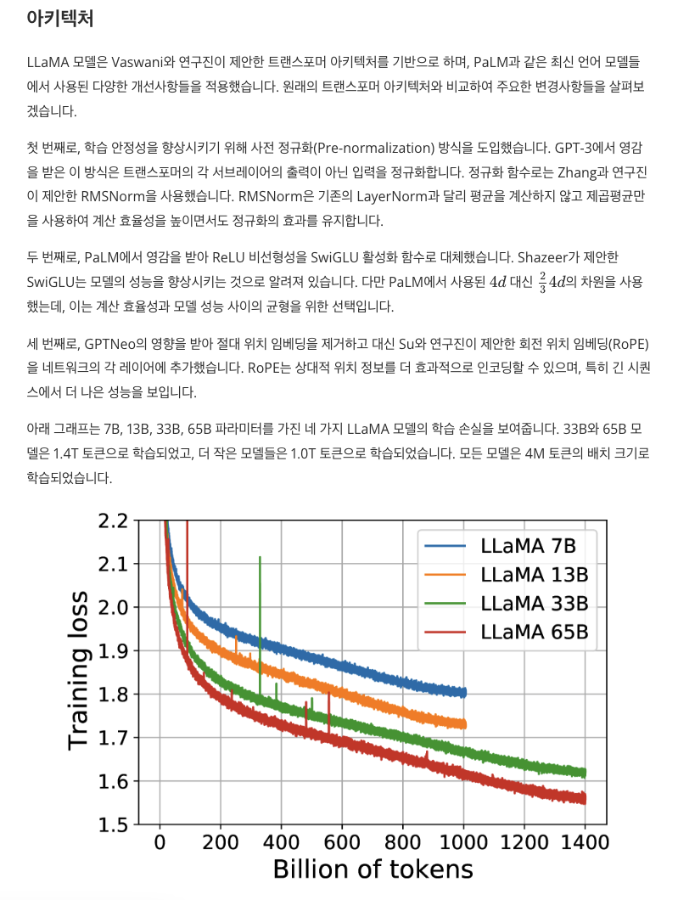
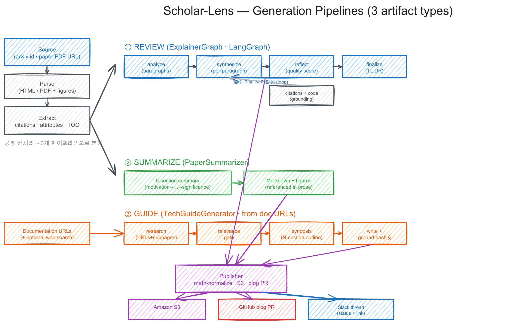
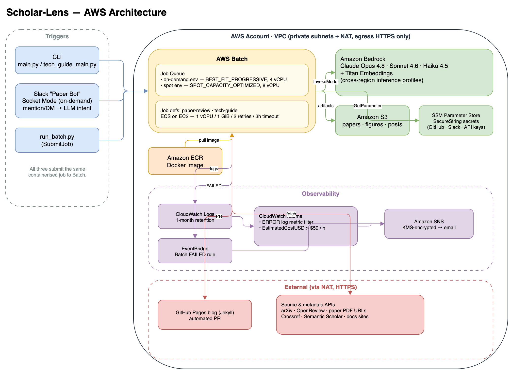

<div align="center">

# 👩‍🏫 Scholar-Lens

**Turn AI/ML papers and documentation into publishable content — paper reviews, summaries, and technical guides.**

Driven from the CLI, AWS Batch, or a Slack bot · powered by Amazon Bedrock (Claude).

[](https://github.com/bits-bytes-nn/scholar-lens/actions/workflows/ci.yml)


-green)

🇰🇷 [한국어 README](./README.ko.md)



</div>

---

## What it does

Scholar-Lens produces three kinds of artifact from a paper or a set of documentation URLs:

| Artifact | Input | Output |
| --- | --- | --- |
| 📝 **Review** | one paper (arXiv ID or PDF URL) | in-depth, section-by-section explanation (intuition → formalism → code) via a multi-stage LangGraph workflow |
| 📄 **Summary** | one paper (arXiv ID or PDF URL) | a concise five-section summary (motivation · solution · implementation · results · significance) |
| 📚 **Tech Guide** | one or more documentation URLs | a hands-on, source-grounded technical guide / tutorial |

Every artifact is clean, blog-ready Markdown that can be uploaded to S3 and opened as a pull request against a Jekyll blog.

## Highlights

- **Any AI/ML paper** — accepts an arXiv ID *or* an arbitrary paper **PDF URL** (non-PDF URLs are rejected). arXiv is no longer required.
- **Grounded, not hallucinated** — citations resolve through Crossref / Semantic Scholar with a title-similarity gate; the writer may only link URLs that appear in its sources. Tech guides run a per-section fact-check pass.
- **Latest Claude** — Amazon Bedrock with Claude Opus 4.8 / Sonnet 5 / Haiku 4.5 and adaptive thinking, per-stage configurable.
- **Code-aware reviews** — optional GitHub repository analysis with FAISS semantic search.
- **On-demand Slack bot** — mention it with a paper or doc URLs; it parses your *explicit* request with an LLM, runs a Batch job, and replies in-thread with a link to the result. Hosted serverlessly on AWS (Slack Events API → Lambda), so it's always on with nothing to keep running locally.
- **Scalable & observable** — AWS Batch (on-demand + spot), CloudWatch alarms, EventBridge→SNS failure alerts, encrypted SecureString secrets.

## Architecture

### Generation pipelines

The three artifact types share a front-end (resolve → parse → extract) and then diverge:



### AWS infrastructure

All work runs as a containerised job on AWS Batch; the same job is submitted by the CLI, the Slack bot, or `run_batch.py`:



### Core components

| Module | Responsibility |
| --- | --- |
| `paper_source.py` | Resolve an arXiv ID or paper PDF URL to a `PaperSource`; validate that URL sources serve a PDF (with an SSRF guard). |
| `parser.py` · `content_extractor.py` | HTML/PDF parsing + figure extraction; structured citation / attribute / TOC extraction. |
| `citation_metadata.py` · `citation_summarizer.py` | Abstract-first reference resolution (Crossref / Semantic Scholar), rate-limited, title-gated. |
| `explainer.py` | `ExplainerGraph` — the multi-stage LangGraph review workflow. |
| `summarizer.py` | `PaperSummarizer` — the five-section summary. |
| `tech_guide.py` · `web_research.py` | Research doc URLs (+ sub-pages + web search) and write a grounded guide. |
| `code_retriever.py` | Clone repos and run semantic code search (FAISS). |
| `publisher.py` | Artifact-agnostic S3 upload + Jekyll blog PR. |
| `slack/` | The on-demand Paper Bot (intent parsing → Batch dispatch). |

> 📖 For a deep dive into the internals — data flow, module reference, prompts, the citation pipeline, infra, and the Slack Lambda architecture — see the **[design doc](./docs/design.md)**.

## Tech stack

Python 3.12+ · AWS CDK · Docker · Amazon Bedrock · LangChain / LangGraph · PyMuPDF · BeautifulSoup4 · FAISS · Pydantic.

## Configuration

Copy the template and edit it:

```bash
cp scholar_lens/configs/config-template.yaml scholar_lens/configs/config.yaml
```

```yaml
resources:
  project_name: scholar-lens
  stage: dev
  profile_name: your-profile
  default_region_name: ap-northeast-2
  bedrock_region_name: us-west-2
  s3_bucket_name: your-bucket
  github:
    enabled: true
    repo_name: owner/owner.github.io
    review_category: Paper Reviews     # blog category tab labels (configurable)
    summary_category: Paper Summaries
    tech_guide_category: Tech Guides

explanation:
  paper_synthesis_model_id: anthropic.claude-opus-4-8   # newest Claude Opus
summary:
  summary_model_id: anthropic.claude-opus-4-8
tech_guide:
  writing_model_id: anthropic.claude-opus-4-8
  verify_grounding: true               # per-section fact-check pass

output_language: Korean
```

See [`scholar_lens/configs/config-template.yaml`](./scholar_lens/configs/config-template.yaml) for the full schema.

## Usage

### Setup

```bash
poetry install --with dev          # dependencies + dev/test tools
cp .env.template .env               # then fill in tokens (see .env.template)
python scripts/deploy_infra.py      # deploy AWS infrastructure (CDK)
```

### Generate artifacts (CLI)

```bash
# REVIEW — --source accepts an arXiv ID or a paper PDF URL
python scholar_lens/main.py --source 2312.11805 --parse-pdf True
python scholar_lens/main.py --source https://openreview.net/pdf?id=XXXX

# SUMMARY (concise five-section format)
python scholar_lens/main.py --source 2312.11805 --mode summarize

# TECH GUIDE from documentation URLs
python scholar_lens/tech_guide_main.py \
  --urls https://docs.framework.io/start https://docs.framework.io/api \
  --search-queries "framework.io best practices"

# Submit as an AWS Batch job
python scripts/run_batch.py --source 2505.09388 --mode review \
  --repo-urls https://github.com/org/repo
```

### Slack bot

The bot runs **serverlessly on AWS** — `python scripts/deploy_infra.py` +
`cdk deploy` provisions a receiver Lambda behind an API Gateway HTTP API plus a
worker Lambda. Point your Slack app's **Event Subscriptions** Request URL at the
receiver (its URL is a CDK output, `SlackEventsRequestUrl`), subscribe to
`app_mention` + `message.im`, and set `SLACK_BOT_TOKEN` / `SLACK_SIGNING_SECRET`.
There's nothing to keep running on a laptop.

Then mention the bot with what you want done — e.g. `review 2401.06066`,
`summarize https://arxiv.org/pdf/2401.06066`, or
`guide https://docs.framework.io/start`. The result is saved to S3 / published to
your blog, and the bot posts the status and a link back in the thread.

```bash
# Local-dev fallback only: run the bot in Socket Mode instead of the Events API
# (needs SLACK_BOT_TOKEN / SLACK_APP_TOKEN and Socket Mode enabled on the app).
python -m scholar_lens.slack.bot
```

> 💡 Run the bot on its own dedicated Slack app so it never shares tokens with
> another bot in the same workspace.

## Testing & quality

```bash
poetry run pytest tests/ --cov=scholar_lens --cov-report=term-missing  # all AWS/network mocked
poetry run ruff check scholar_lens scripts tests
poetry run black --check scholar_lens scripts tests
poetry run mypy scholar_lens
poetry run python scripts/ci_synth_check.py   # validate CDK synth, no AWS account needed
```

CI (`.github/workflows/ci.yml`) runs lint/format, the pytest matrix (Python 3.12 & 3.13),
and a CDK synth check on every push and PR.
